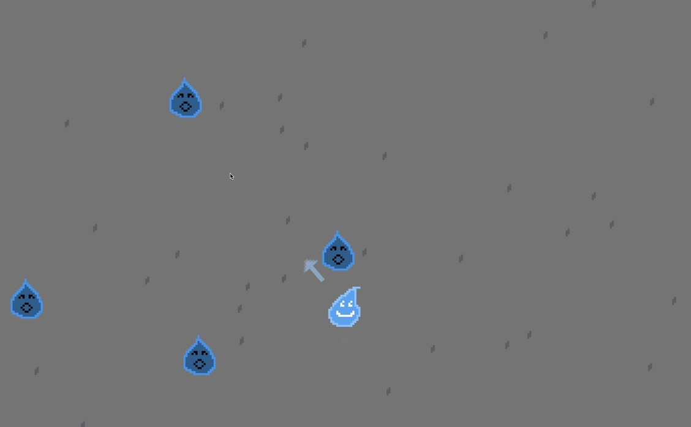
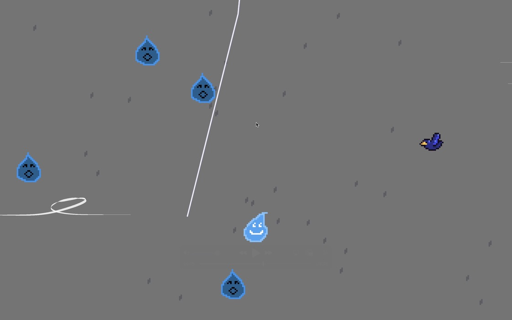

# Drizzle Dash
*Drizzle Dash* is a *Getting Over It*-inspired physics platformer where you play as a fallen raindrop trying to climb back to the clouds. Dash between falling raindrops to ascend your way to the heavens, but beware of birds and lightning strikes along your way!

Created for the Cornell University DGA Spring 2026 Game Jam.

## Play the Game
The best way to experience Drizzle Dash is to play it yourself.     
[Download on itch.io.](https://boosterball478.itch.io/drizzle-dash) 

## Screenshots
#### Video
[Watch video here](https://github.com/CadenLau/Spring-26-Game-Jam/raw/main/gameplay/game.mov)
#### Gameplay

## Requirements
- Unity 6.0 LTS

## Installation (Unity Editor)
### 1. Clone the repository
    git clone https://github.com/CadenLau/Spring-26-Game-Jam.git
### 2. Open in Unity
1. Open Unity Hub.
2. Click Add -> Add project from disk.
3. Select the cloned project folder.
4. Open the project using Unity 6.0 LTS.

## Running the Game in Unity
Open StartScreen from the Assets/Scenes folder and press play.

## Usage
### Controls
| Key | Action |
| ----------- | ----------- |
| A/D | Left/Right |
| Left click | Dash |
| Mouse | Aim |
| Escape | Pause |

## Features
- Tight, skill-based dash movement
- Unique obstacles, challenging both horizontal and vertical movement
- Classic rage-platformer design inspired by *Getting Over It*

## Project Structure
    ├── Assets/
    |   ├── Art/
    |   ├── LightningBolt/
    |   ├── Prefabs/
    |   ├── Scenes/
    |   ├── Scripts/
    |   ├── Settings/
    |   ├── Sound/
    |   ├── TextMesh Pro/
    |   └── _Recovery/
    ├── gameplay/
    ├── Packages/
    ├── ProjectSettings/
    ├── LICENSE.txt
    ├── .gitignore
    └── README.md

## Built With
- Unity 6.0 LTS

## License
This project is licensed under the Creative Commons Attribution–NonCommercial–ShareAlike 4.0 International License (CC BY-NC-SA 4.0).

You are free to play, share, and modify this project for non-commercial purposes, with appropriate attribution.

See [`LICENSE`](LICENSE.txt) file for details.
